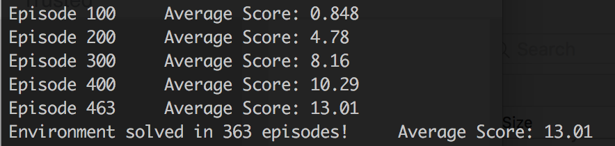
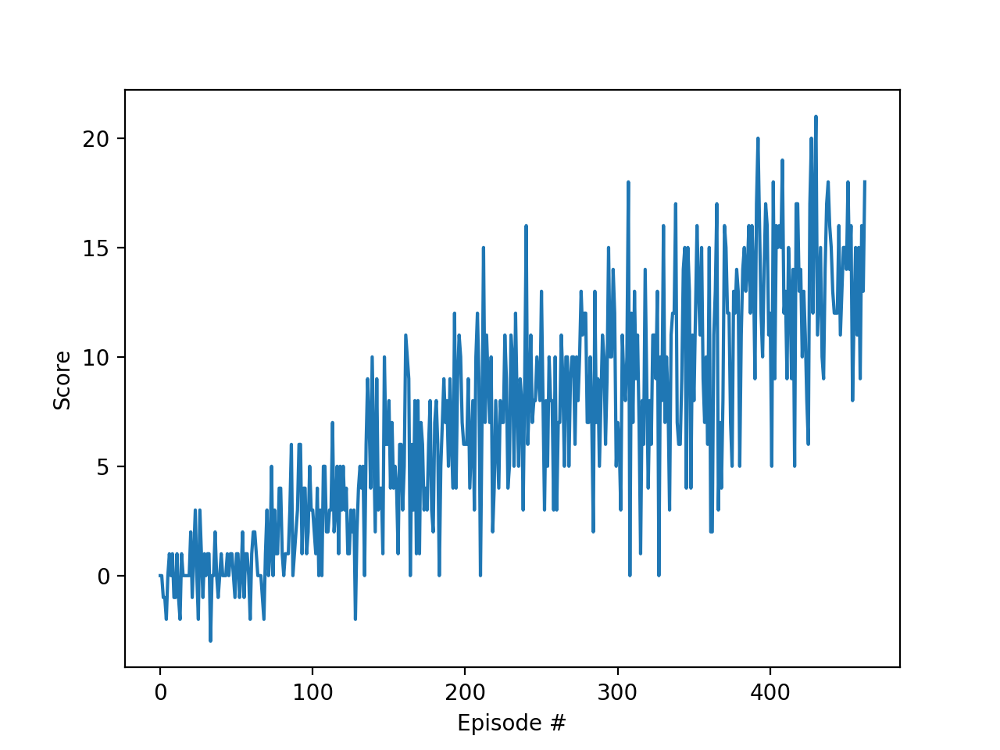

# Report

_Note:_ The code in this project is largely adapted from the implementation of the LunarLander exercise (Lesson 2, Part 6).  This is the only code that was re-used or "copied" from any other source, and determined to be allowed due to the suggestion in the "Not sure where to start" section of the project page:

_Adapt the code from the exercise to the project, while making as few modifications as possible._

If the use of this code is problematic or prohibited in any way, please let me know.

### Learning Algorithm

The algorithm is a straightforward implementation of DQN as described in the [Deep Mind paper published in Nature](https://storage.googleapis.com/deepmind-media/dqn/DQNNaturePaper.pdf) with fixed-Q targets.

In Deep-Q Learning, the goal is to approximate the Action-Value function _Q_ through exploration of an environment.  This _Q_-function approximates the expected reward of any given action in any given state.

To accomplish this, the agent interacts with an environment iteratively to collect some _reward_, which is then stored as individual _experiences_ in a buffer.  Every `N` episodes -- configurable in the code as `UPDATE_EVERY` -- samples are taken from this experience buffer to train a fully-connected MLP network.  The learned weights from this network are then used to inform new decisions, collect new rewards, sample experiences, and train, and the cycle continues.

### Tuning

To achieve the performance described below, certain hyperparameters for the algorithm had to be tuned to find a satisfactory result. The hyperparameters chosen were determined through trial-and-error, where necessary.

These hyperparameters are described as follows:

**Replay Buffer Size**

`BUFFER_SIZE = int(1e5)` 

The replay buffer size is the number of agent experiences available in the buffer for sampling during the training stage of the fully-connected MLP network. Thus a larger value ensures that the network is learning from experiences outisde of its own recent history, but as this buffer is stored in memory, it is resource-constrained.  For this project, run on 2014 Macbook Pro, a buffer size of 10^5 experiences was sufficient; however, it proved too large and had to be constrained to 10^4 for the VisualBanana environment, which is based on pixels and, as such, a greater state size.

**Batch Size**

`BATCH_SIZE = 64`

This is the number of samples taken from the Replay Buffer each time the fully-connected is trained. The Udactiy DQN exercise code initialized the batch size at `64`, and it was left unchanged for this project.

**Gamma - Discount Factor**

`GAMMA = 0.99`

This is the time-discount factor, which is applied to the expected action-value of the subsequent state. A low value here optimizes for short-term rewards, while a value close to 1 discounts future rewards very little.

**Tau**

`TAU = 1e-3`

This controls how much the Q-network is updated after each learning and optimization stage.  A value of 1 replaces the expected Q values entirely, while a value of zero equates to no update.

**Learning Rate**

`LR = 5e-4`

The learning rate is a parameter of the FC network optimizer that determines how much the weights are updated on each pass through the optimizer (in this case ADAM).

**Update Frequency** 
`UPDATE_EVERY = 4`

This controls the number of episodes that are run between training of the fully-connected Q-network.

### Architecture

**Fully-Connect MLP Layers**

The network consists of three layers.  The first layer takes the environment state vector as input and maps to 64 outputs, the second layer also outputs 64 units, and the third layer maps its output to the action space, which in this case is 4. Both the first and second FC layers implement a ReLU activation function.

### Performance

This implementation "solved" the environment (gaining a score of >13 averaged over 100 consecutive episodes) after 363 episodes. The console output and a plot of the scores are displayed below.

### Future Improvements

#### Double DQN

For the double-DQN algorithm, only a few changes are necessary. An implementation of this is shown in a Jupyter Notebook in the project directory labeled `Navigation-DoubleDQN.ipynb`.  In Double-DQN, to counteract the early noisiness of the network, one network is used to select the action to take (i.e. which action has the highest Q value for that action), and another network to determine the Q value for that action.  In this project no significant performance changes were observed.

#### Dueling DQN

In Dueling DQN, the network output is split into Advantage and Value estimations.  The value estimation determines the expected reward from being at a particular state, and the advantage estimation determines how much more valuable any particular _action_ is compared to the others.  This was not implemented.

#### Prioritized Experience Replay

PER is exactly what it sounds like.  Instead of sampling randomly from the experience buffer, as is done in this project, PER assigns an "error" score to each experience based on the difference between the expected reward and the observed reward for that experience. This has not been implemented but could have a significant benefit in reducing the number of episodes required to solve this environment.